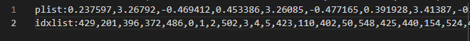

# FEM-StVK
This is a simple implementation of FEM for simulating StVK material. The numerical method used here is Gradient Descent.

# Main Classes

* main.cpp

* FEMSimObj.cpp

* MeshLoader.cpp

* Mesh.cpp

  * TetMesh.cpp

* Constraint.cpp

  * TetConstraint.cpp

  * CollisionConstraint.cpp

    

# Input

A single "tet" file looks like this:

It could be generated by a Houdini node provided by my mentor **Haowei Han** (RD in Light Chaser Animation).

# Output

This program will output a series of "tet" files corresponding to each frame, which includes the information of positions and indices of a mesh. These files could be read by the "tetHDA" node in Houdini which is mentioned above. Therefore, the visualization of this program is in Houdini.

# Demo GIF 

## Free Fall

(unit/point mass = 1.0f, mu = 5e4, lambda = 20e4)

## Comparisons

**unit/point mass = 0.5f, mu = 5e4, lambda = 20e4**

**unit/point mass = 1.0f, mu = 5e4, lambda = 20e4**

**unit/point mass = 1.0f, mu = 8e4, lambda = 32e4**

# Limitations

This implementation of FEM simulating StVK ONLY contains two constraints: tetrahedra constraint and collision constraint, which means the rest of constraints distance constraint and attachment constraint. Meanwhile, the implementation uses gradient descent instead of Newton's method.